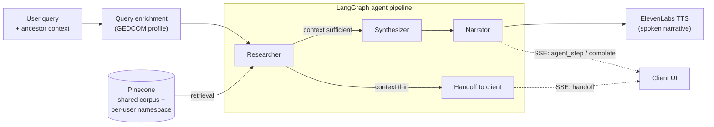

# Heritage Odyssey

**A multi-agent RAG pipeline that turns historical emigration records into voice-narrated family history.**

Heritage Odyssey takes a question about an ancestor or a migration era, retrieves relevant 19th and early-20th-century emigration records from a vector store, and runs them through a three-agent reasoning pipeline that researches, drafts, and narrates an oral-history-style account. The final narrative is streamed to the browser as text and spoken aloud through neural text-to-speech.

[](https://github.com/sjtroxel/Heritage-Odyssey/actions/workflows/ci.yml)


**Live:** [heritage-odyssey.vercel.app](https://heritage-odyssey.vercel.app) (frontend) · [heritage-odyssey.up.railway.app](https://heritage-odyssey.up.railway.app) (API)

---

## What makes this interesting

This is not a single prompt wrapped in a UI. It is a small system with the parts a production AI feature actually needs:

- A **three-node LangGraph agent pipeline** with explicit handoff logic, so the system refuses to hallucinate when retrieval is weak instead of confidently making things up.
- **Dual-source retrieval**: a shared corpus of public-domain historical records, plus each user's own family tree imported from a GEDCOM file into a private, per-user vector namespace.
- A **standalone Python evaluation microservice** (FastAPI) that scores every narrative across six quality dimensions and persists the results for trend analysis.
- A **promptfoo regression suite** wired into CI as a gated quality gate, plus **LangSmith** tracing in production for per-node latency and token cost.
- Streaming end to end: the agent pipeline emits server-sent events, the client renders each step live, and completed text is handed to neural TTS.

---

## Architecture



**Request lifecycle:**

1. The query is enriched with structured context from the user's imported ancestor profile before it ever reaches the graph.
2. The **Researcher** queries Pinecone across both the shared corpus and the user's private namespace. It proceeds only when at least two general records clear the `0.25` similarity threshold, or the user has matching records in their own imported tree. Otherwise it emits a `handoff` event and exits rather than feeding thin context forward.
3. The **Synthesizer** drafts a historical narrative from the retrieved documents.
4. The **Narrator** rewrites the draft for spoken delivery. Its output is what goes to text-to-speech.
5. Every stage yields a server-sent event (`agent_step`, `complete`, `handoff`, `error`) from an async generator in `narrativeService.ts`. The client renders the pipeline as it runs, then plays the completed narrative through ElevenLabs in one of four selectable voices. Saved narratives can be replayed in any voice from the My Records panel.

Two cost guardrails sit in front of the model calls: a per-IP burst limiter and a per-IP daily narration quota (each synthesis counts once), surfaced to the user as a live remaining-count. Voice input goes through Whisper and is shown back to the user for confirmation before it is submitted, so a misheard fragment never spends a generation.

The graph itself stays stable. Query enrichment happens in the service layer before `graph.invoke`, so adding context sources does not mean rewriting the agent wiring.

---

## Tech stack

| Layer | Technology |
| :--- | :--- |
| Backend | Express 5, TypeScript (strict, NodeNext) |
| Agent orchestration | LangGraph (`@langchain/langgraph`), three-node graph |
| Vector database | Pinecone (1536-dim, cosine), per-user namespaces |
| LLM | OpenAI GPT-4o across all three agent nodes |
| Text-to-speech | ElevenLabs neural TTS (four selectable narrating voices) |
| Speech-to-text | OpenAI Whisper (voice query input) |
| Database | Neon PostgreSQL, Drizzle ORM |
| Auth | JWT access tokens + httpOnly refresh, Google OAuth, demo mode |
| Frontend | React 19, Vite, Tailwind v4, Framer Motion |
| Evaluation service | Python 3.12, FastAPI, Ragas, psycopg2 |
| Observability | LangSmith tracing, promptfoo regression suite |
| Testing | Vitest (unit + integration), Playwright (opt-in E2E), pytest |
| Deployment | Railway (API), Vercel (frontend), GitHub Actions (CI) |

---

## The evaluation system

Most portfolio AI projects stop at "it returns an answer." Heritage Odyssey treats narrative quality as something to measure, store, and regression-test. This is implemented as a separate FastAPI microservice in [`evaluation-service/`](evaluation-service/) so the evaluation surface is independent of the request hot path.

**Six scoring dimensions** combine cheap deterministic checks with an LLM judge and retrieval-aware metrics:

| Scorer | Type | What it measures |
| :--- | :--- | :--- |
| `historical_grounding` | Deterministic heuristic | Density of period-appropriate historical signal |
| `citation_coverage` | Deterministic n-gram overlap | How much of the narrative is supported by retrieved docs |
| `emotional_resonance` | LLM-as-judge (GPT-4o-mini) | Narrative vividness and oral-history quality |
| `faithfulness` | Ragas | Whether claims are entailed by the source context |
| `answer_relevancy` | Ragas | Whether the narrative answers the query |
| `context_recall` | Ragas | Whether retrieval surfaced the needed context |

Scores are written to an `eval_scores` table on Neon (one schema source of truth, managed by Drizzle) and read back through a history endpoint for trend analysis over time.

**Endpoints:** `POST /evaluate/narrative`, `POST /evaluate/batch`, `GET /scores/history`.

**CI quality gates:**

- A **promptfoo** suite of 15+ cases (happy paths, sparse-record edge cases, and out-of-domain queries that should trigger handoff) runs against the live API through a custom SSE-parsing provider. It is gated behind an `E2E_LIVE` flag so it never spends model credits on an ordinary push.
- A **`python-eval`** job runs the full pytest suite (14 tests, all external calls mocked) on every push. No credits, fast feedback.
- **LangSmith** tracing is active in production: every `graph.stream()` call records per-node latency and token cost with no code changes, through LangChain's callback system.

---

## Repository structure

```
server/              Express + TypeScript: agents, RAG, auth, API
  src/agents/        LangGraph graph + the three node implementations
  src/services/      narrativeService (pipeline entry), vectorStore, voice
client/              React 19 + Vite + Tailwind v4 frontend
shared/              TypeScript types shared by both workspaces
scripts/             Pinecone document ingestion
evaluation/          Python: original Ragas + TruLens golden-set suite
evaluation-service/  Python: FastAPI scoring microservice (six scorers)
project-specs/       Phase specs, architecture docs, narrative rubric
promptfoo.yaml       Narrative regression suite (CI quality gate)
```

---

## Getting started

**Prerequisites:** Node 22 (see `.nvmrc`), Python 3.12, and accounts for OpenAI, Pinecone, ElevenLabs, and Neon.

```bash
# Install all workspaces
npm install

# Configure environment
cp .env.example server/.env
# then fill in real keys in server/.env

# Run server + client together with hot reload
npm run dev
```

The frontend comes up on Vite's dev server and the API on port 3000. A **demo mode** account is available from the login screen, so the app is explorable without provisioning every external service.

**Database migrations** (Drizzle against Neon):

```bash
cd server
npx drizzle-kit generate    # generate a migration from schema changes
npx drizzle-kit push        # apply it (inspect the SQL first)
```

**Run the evaluation microservice locally:**

```bash
npm run eval:service        # FastAPI on port 8000, /docs for OpenAPI UI
```

---

## Testing and CI

```bash
npm run typecheck    # tsc --noEmit across all workspaces
npm run lint         # ESLint across all workspaces
npm run test         # Vitest: 113 server + 25 client
npm run coverage     # coverage with thresholds
npm run build        # build all workspaces
```

The GitHub Actions pipeline runs the full Node gate (typecheck, lint, test, coverage, build) plus a secret scan and dependency audit, alongside the independent `python-eval` job. Playwright E2E and the promptfoo suite are opt-in and credit-gated, never on the default push path.

```bash
# Python evaluation suite
cd evaluation-service && python -m pytest      # 14 tests, all mocked
```

---

## Data scope

The current version indexes 19th and early-20th-century European emigration records: the period and population best represented in freely available, digitized, public-domain historical archives. Ellis Island arrival manifests, emigration ship records, and first-person accounts of Atlantic crossings exist in machine-readable form at scale.

That boundary leaves out migration histories that matter just as much and are, for now, underrepresented in the index. Among them:

- The transatlantic slave trade and the forced migration of enslaved Africans through the Middle Passage.
- The forced displacement of Indigenous peoples of North America, including the removal-era relocations of the Trail of Tears.
- Asian migration to the Americas, including Chinese labor during the Gold Rush and railroad era and the Chinese Exclusion period.
- Migration to the United States from Mexico, Central America, and the wider Latin American region, both historical and present-day.
- Migration between Africa and Europe, both historical and present-day.
- Contemporary refugee and displacement movements.

The reason is data availability, not design preference. Records for these histories are often not yet digitized, not in the public domain, or not yet indexed in machine-readable form. Shipping a focused, honest v1 is a deliberate choice over implying coverage the underlying data cannot support: a retrieval system with no relevant documents returns empty results, which is worse than clear scope language.

The pipeline architecture is ancestry-agnostic. Broadening coverage, through sources such as Freedmen's Bureau records, Chinese Exclusion Act case files, oral-history collections, and displacement datasets, is a data-ingestion effort rather than an architectural rewrite, and it is a priority for future versions.

---

## Project status

| Phase | Focus | Status |
| :--- | :--- | :--- |
| 1-8 | Foundation through deployment | Complete |
| 9 | Feature completion and portfolio polish | Complete |
| 10 | Ancestor profile system, extended user profiles | Complete |
| 11A | GEDCOM import, per-user namespaces, dual-source RAG, Google OAuth | Complete |
| 12A | Python FastAPI evaluation microservice | Complete |

---

## License and usage

This is a personal portfolio project by [sjtroxel](https://github.com/sjtroxel). The code is published for review and demonstration. It is not currently released under an open-source license; please reach out before reusing substantial portions.
